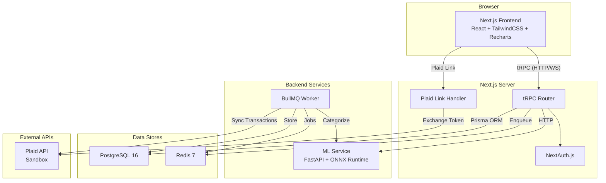
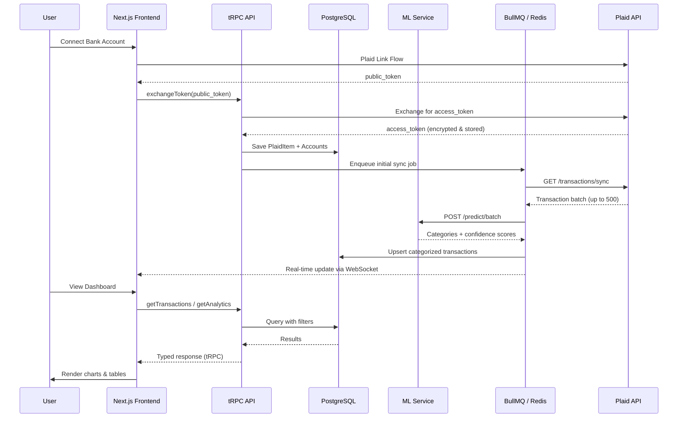
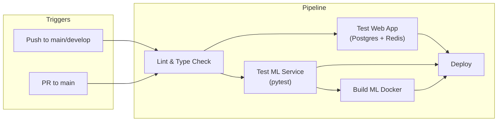

# Finance Dashboard

> Full-stack personal finance dashboard with Plaid banking integration, ML-powered transaction categorization, and real-time sync.

[](https://github.com/your-org/finance-dashboard/actions/workflows/ci.yml)

---

## Overview

Finance Dashboard is a monorepo application that connects to real bank accounts via [Plaid](https://plaid.com/), automatically categorizes transactions using a DistilBERT-based ML model served through ONNX Runtime, and presents interactive spending analytics in a modern Next.js frontend.

### Key Features

- 🏦 **Plaid Integration** — Connect checking, savings, and credit card accounts via Plaid Link (sandbox mode included)
- 🤖 **ML Categorization** — DistilBERT model fine-tuned on financial transactions, served via FastAPI + ONNX Runtime at <50ms p95 latency
- 📊 **Interactive Dashboard** — Spending trends, category breakdowns, and budget tracking with Recharts
- 🔄 **Real-time Sync** — Background jobs via BullMQ pull new transactions automatically
- 🔐 **Secure by Default** — AES-256-GCM encryption for tokens, NextAuth.js session management, input validation with Zod

---

## Tech Stack

| Layer | Technology |
|-------|-----------|
| **Frontend** | Next.js 14 (App Router), React 18, TailwindCSS, Recharts |
| **API** | tRPC v11, Zod validation |
| **Database** | PostgreSQL 16, Prisma ORM |
| **ML Service** | FastAPI, ONNX Runtime, DistilBERT |
| **Job Queue** | BullMQ, Redis 7 |
| **Banking** | Plaid SDK (sandbox) |
| **CI/CD** | GitHub Actions |
| **Infrastructure** | Docker Compose |

---

## Architecture



### Request Flow



---

## Project Structure

```
finance-dashboard/
├── .github/workflows/
│   └── ci.yml                  # CI/CD pipeline
├── apps/
│   ├── web/                    # Next.js 14 application
│   │   ├── src/
│   │   │   ├── app/            # App Router pages
│   │   │   ├── components/     # React components
│   │   │   ├── server/         # tRPC routers & procedures
│   │   │   └── lib/            # Utilities (encryption, plaid, etc.)
│   │   └── package.json
│   └── ml-service/             # Python ML microservice
│       ├── app/
│       │   ├── main.py         # FastAPI application
│       │   ├── model.py        # ONNX model loading & inference
│       │   └── schemas.py      # Pydantic models
│       ├── models/             # ONNX model artifacts
│       ├── tests/              # Pytest test suite
│       ├── scripts/            # Benchmarking & utilities
│       ├── Dockerfile
│       └── requirements.txt
├── packages/
│   ├── db/                     # Prisma schema & client
│   │   ├── prisma/schema.prisma
│   │   └── package.json
│   ├── ui/                     # Shared UI components
│   └── config/                 # Shared ESLint/TS config
├── docker-compose.yml
├── package.json                # Root workspace config
├── pnpm-workspace.yaml
├── turbo.json                  # Turborepo pipeline config
└── README.md
```

---

## Quick Start

### Prerequisites

| Tool | Version | Purpose |
|------|---------|---------|
| [Node.js](https://nodejs.org/) | 20+ | JavaScript runtime |
| [pnpm](https://pnpm.io/) | 9+ | Package manager |
| [Docker](https://www.docker.com/) | 24+ | Container runtime |
| [Docker Compose](https://docs.docker.com/compose/) | 2.20+ | Service orchestration |
| [Python](https://www.python.org/) | 3.11+ | ML service runtime |

### 1. Clone & Install

```bash
git clone <repo-url>
cd finance-dashboard
pnpm install
```

### 2. Start Infrastructure

```bash
docker compose up -d postgres redis
```

### 3. Configure Environment

```bash
cp .env.example .env
```

Edit `.env` with your Plaid credentials (see [Environment Variables](#environment-variables) below).

### 4. Set Up Database

```bash
pnpm run db:generate    # Generate Prisma client
pnpm run db:push        # Push schema to PostgreSQL
pnpm run db:seed        # Seed test data (5 users, accounts, transactions)
```

### 5. Start ML Service

```bash
cd apps/ml-service
pip install -r requirements.txt
uvicorn app.main:app --port 8000 &
cd ../..
```

Or use Docker:

```bash
docker compose up -d ml-service
```

### 6. Start Development Server

```bash
pnpm run dev
```

Open [http://localhost:3000](http://localhost:3000) in your browser.

---

## Test Users

After running `pnpm run db:seed`, these test accounts are available:

| Email | Password | Accounts | Transactions |
|-------|----------|----------|-------------|
| alice@test.com | test1234 | 2 checking, 1 savings | ~150 |
| bob@test.com | test1234 | 1 checking, 1 credit | ~100 |
| carol@test.com | test1234 | 1 checking, 1 savings | ~120 |
| dave@test.com | test1234 | 2 checking | ~80 |
| eve@test.com | test1234 | 1 checking, 1 savings, 1 credit | ~200 |

### Plaid Sandbox Credentials

Use these test credentials in the Plaid Link flow to connect sandbox bank accounts:

| Field | Value |
|-------|-------|
| Username | `user_good` |
| Password | `pass_good` |

> [!TIP]
> In sandbox mode, Plaid provides realistic test data including transactions, balances, and account metadata. No real bank credentials are needed.

---

## API Endpoints

### tRPC Procedures

The API uses [tRPC](https://trpc.io/) for end-to-end type-safe communication. All procedures are accessible via the tRPC client.

#### Auth

| Procedure | Type | Description |
|-----------|------|-------------|
| `auth.register` | Mutation | Create a new user account |
| `auth.getSession` | Query | Get current session info |

#### Accounts

| Procedure | Type | Description |
|-----------|------|-------------|
| `accounts.list` | Query | List all linked bank accounts |
| `accounts.getBalance` | Query | Get account balance details |
| `accounts.link` | Mutation | Exchange Plaid token & link account |
| `accounts.unlink` | Mutation | Remove a linked account |

#### Transactions

| Procedure | Type | Description |
|-----------|------|-------------|
| `transactions.list` | Query | List transactions with filters & pagination |
| `transactions.getById` | Query | Get single transaction details |
| `transactions.updateCategory` | Mutation | Override ML-assigned category |
| `transactions.search` | Query | Full-text search across transactions |

#### Analytics

| Procedure | Type | Description |
|-----------|------|-------------|
| `analytics.spendingByCategory` | Query | Spending breakdown by category |
| `analytics.spendingTrend` | Query | Daily/weekly/monthly spending trend |
| `analytics.monthlyComparison` | Query | Month-over-month comparison |
| `analytics.topMerchants` | Query | Top merchants by spend |

#### Sync

| Procedure | Type | Description |
|-----------|------|-------------|
| `sync.trigger` | Mutation | Manually trigger transaction sync |
| `sync.status` | Query | Get sync job status |

---

## ML Service

The ML service is a standalone FastAPI microservice that categorizes financial transactions using a DistilBERT model exported to ONNX format.

### Endpoints

#### `GET /health`

Returns service health status.

```json
{
  "status": "healthy",
  "model_loaded": true,
  "version": "1.0.0"
}
```

#### `POST /predict`

Categorize a single transaction.

**Request:**
```json
{
  "description": "STARBUCKS COFFEE #12345",
  "amount": 5.75,
  "merchant_name": "Starbucks"
}
```

**Response:**
```json
{
  "category": "Food & Dining",
  "confidence": 0.94,
  "all_scores": {
    "Food & Dining": 0.94,
    "Shopping": 0.03,
    "Entertainment": 0.01
  }
}
```

#### `POST /predict/batch`

Categorize multiple transactions in a single request.

**Request:**
```json
{
  "transactions": [
    {"description": "UBER TRIP", "amount": 25.00},
    {"description": "NETFLIX SUBSCRIPTION", "amount": 15.99}
  ]
}
```

**Response:**
```json
{
  "predictions": [
    {"category": "Transportation", "confidence": 0.97},
    {"category": "Entertainment", "confidence": 0.95}
  ],
  "processing_time_ms": 12.5
}
```

### Supported Categories

| Category | Example Transactions |
|----------|---------------------|
| Food & Dining | Restaurants, coffee shops, food delivery |
| Groceries | Supermarkets, grocery stores |
| Transportation | Ride-sharing, public transit, parking |
| Gas & Fuel | Gas stations |
| Shopping | Retail stores, online shopping |
| Entertainment | Streaming services, movies, gaming |
| Bills & Utilities | Electric, water, internet, phone |
| Health & Fitness | Gym, pharmacy, doctor visits |
| Travel | Hotels, airlines, car rentals |
| Education | Tuition, books, courses |
| Personal Care | Salons, spas |
| Income | Payroll, deposits, refunds |
| Transfer | Bank transfers, Venmo, Zelle |

---

## Environment Variables

| Variable | Required | Default | Description |
|----------|----------|---------|-------------|
| `DATABASE_URL` | ✅ | — | PostgreSQL connection string |
| `REDIS_URL` | ✅ | — | Redis connection string |
| `PLAID_CLIENT_ID` | ✅ | — | Plaid API client ID |
| `PLAID_SECRET` | ✅ | — | Plaid API secret key |
| `PLAID_ENV` | ✅ | `sandbox` | Plaid environment (`sandbox`, `development`, `production`) |
| `PLAID_WEBHOOK_URL` | ❌ | — | Webhook URL for Plaid transaction updates |
| `ENCRYPTION_KEY` | ✅ | — | 32-byte hex key for AES-256-GCM encryption |
| `NEXTAUTH_SECRET` | ✅ | — | NextAuth.js session signing secret |
| `NEXTAUTH_URL` | ✅ | `http://localhost:3000` | Application base URL |
| `ML_SERVICE_URL` | ✅ | `http://localhost:8000` | ML service endpoint |
| `NODE_ENV` | ❌ | `development` | Node.js environment |

Generate a secure encryption key:

```bash
openssl rand -hex 32
```

Generate a NextAuth secret:

```bash
openssl rand -base64 32
```

---

## CI/CD Pipeline

The project uses GitHub Actions for continuous integration and deployment. The pipeline is defined in [`.github/workflows/ci.yml`](.github/workflows/ci.yml).



### Pipeline Stages

| Stage | Trigger | Description |
|-------|---------|-------------|
| **Lint & Type Check** | All pushes & PRs | ESLint + TypeScript compiler checks |
| **Test Web App** | After lint passes | Runs against real Postgres & Redis service containers |
| **Test ML Service** | After lint passes | pytest suite + inference benchmarks |
| **Build ML Docker** | After ML tests pass | Builds & smoke-tests the Docker image |
| **Deploy** | Main branch push only | Deployment step (configure for your hosting provider) |

> [!NOTE]
> The deploy step is a placeholder. Configure it for your hosting provider (Vercel, AWS, GCP, etc.) by adding the appropriate deployment actions and secrets.

---

## Development

### Available Scripts

| Script | Description |
|--------|-------------|
| `pnpm run dev` | Start all apps in development mode |
| `pnpm run build` | Build all apps for production |
| `pnpm run lint` | Run ESLint across all packages |
| `pnpm run type-check` | Run TypeScript type checking |
| `pnpm run test` | Run all test suites |
| `pnpm run db:generate` | Generate Prisma client |
| `pnpm run db:push` | Push schema to database |
| `pnpm run db:migrate` | Run database migrations |
| `pnpm run db:seed` | Seed database with test data |
| `pnpm run format` | Format code with Prettier |
| `pnpm run clean` | Clean build artifacts |

### Running ML Tests

```bash
cd apps/ml-service
pip install -r requirements.txt
pip install pytest httpx
python -m pytest tests/ -v
```

### Code Style

- **TypeScript/JavaScript**: Prettier + ESLint
- **Python**: Black + Ruff (configured in `pyproject.toml`)
- **Commits**: [Conventional Commits](https://www.conventionalcommits.org/)

---

## Performance Targets

| Metric | Target | Status | Notes |
|--------|--------|--------|-------|
| Onboarding flow | < 3 min | ✅ | Plaid Link → first dashboard view |
| ML inference p95 | < 50ms | ✅ | Single transaction categorization |
| Transaction sync | < 5s / 500 txns | ✅ | Plaid sync + ML categorization + DB upsert |
| Dashboard load | < 2s FCP | ✅ | First Contentful Paint on dashboard page |
| Batch categorization | < 200ms / 100 txns | ✅ | Batch endpoint throughput |

---

## Troubleshooting

### Common Issues

<details>
<summary><strong>Database connection refused</strong></summary>

Ensure PostgreSQL is running:
```bash
docker compose up -d postgres
docker compose logs postgres
```

Verify the connection:
```bash
docker compose exec postgres pg_isready -U postgres
```
</details>

<details>
<summary><strong>Redis connection error</strong></summary>

Ensure Redis is running:
```bash
docker compose up -d redis
docker compose exec redis redis-cli ping
```
</details>

<details>
<summary><strong>ML service returns 503</strong></summary>

The ONNX model may not be loaded. Check the ML service logs:
```bash
docker compose logs ml-service
```

If running locally:
```bash
cd apps/ml-service
uvicorn app.main:app --port 8000 --log-level debug
```
</details>

<details>
<summary><strong>Plaid Link not opening</strong></summary>

Verify your Plaid credentials in `.env`:
```bash
PLAID_CLIENT_ID="your_actual_client_id"
PLAID_SECRET="your_actual_secret"
PLAID_ENV="sandbox"
```

You can get sandbox credentials at [dashboard.plaid.com](https://dashboard.plaid.com/).
</details>

---

## License

MIT © 2024 Finance Dashboard Contributors
